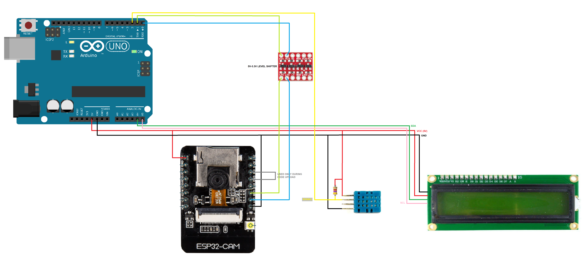

# DHT11 & ESP32-CAM Smart-Device
 
This github repository contanis a full report detailing the implemention of a DHT11 sensor and ESP32-CAM in creating a smart-device. Above you will find the figures, and libraries used along with the arduino IDE sketches written for both the ESP32-CAM and Arduino UNO applied to this project. This project also utilized an LCD display and level shifter, below you can see a figure displaying all the connections between the variouse devices.
 

